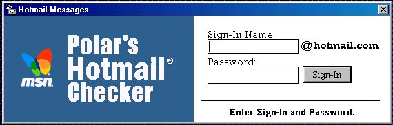



## New Hotmail Messages \(Checker\)\!   \*THE ORIGINAL\*

### Description

This code logs you in to the Hotmail server using standard http commands (the same thing your browser uses). After retrieving your mailbox source from Hotmail, it will tell you how many new messages you have. With this code however, you may do whatever you wish with your account (through programming), once you understand how it works. commented heavily to ensure understanding. if you have any questions or comments, my email address is: nmjblue@hotmail.com...

Enjoy!
 
### More Info
 
Good knowlegde of socket programming, and the http protocol required if you want to expand this program.

Also, this program uses the Catalyst SocketWrench control, so if the one included in this zip doesn't work, you can get it at www.catalyst.com

             |
---                |---
**Submitted On**   |2000-09-02 23:29:38
**By**             |[Bill Katz](https://github.com/Planet-Source-Code/PSCIndex/blob/master/ByAuthor/bill-katz.md)
**Level**          |Advanced
**User Rating**    |4.7 (103 globes from 22 users)
**Compatibility**  |VB 3\.0, VB 4\.0 \(16\-bit\), VB 4\.0 \(32\-bit\), VB 5\.0, VB 6\.0, VB Script, ASP \(Active Server Pages\) 
**Category**       |[Internet/ HTML](https://github.com/Planet-Source-Code/PSCIndex/blob/master/ByCategory/internet-html__1-34.md)
**World**          |[Visual Basic](https://github.com/Planet-Source-Code/PSCIndex/blob/master/ByWorld/visual-basic.md)
**Archive File**   |[CODE\_UPLOAD9704962000\.zip](https://github.com/Planet-Source-Code/bill-katz-new-hotmail-messages-checker-the-original__1-9871/archive/master.zip)

